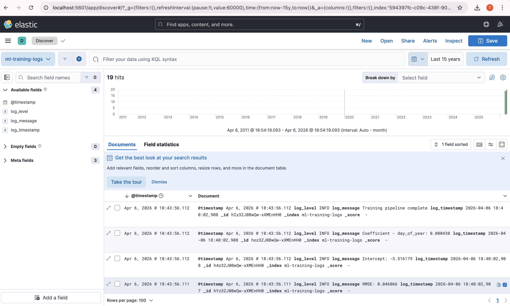
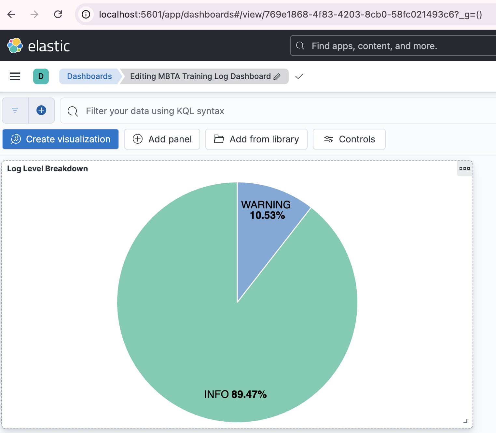

# ELK Lab — MBTA The RIDE Reliability Log Monitoring

This lab sets up the ELK (Elasticsearch, Logstash, Kibana) stack using Docker to monitor logs generated during the training of a Linear Regression model on MBTA The RIDE reliability data.

Unlike the original lab which requires manual installation of Elasticsearch, Logstash, and Kibana, this version uses Docker Compose for a simpler and more reproducible setup.

---

## What This Lab Does

- Spins up Elasticsearch, Logstash, and Kibana using Docker Compose
- Trains a Linear Regression model on MBTA The RIDE on-time performance (OTP) data
- Logs training metrics (MSE, RMSE, R2, OTP stats, feature coefficients) to a file
- Logstash ingests the log file and ships it to Elasticsearch
- Kibana is used to explore and visualise the logs

---

## Dataset

MBTA The RIDE Reliability — daily on-time trip counts for The RIDE paratransit service.

| Column | Description |
|---|---|
| trip_date | Date of service |
| ontime_trip_count | Trips completed on time |
| trip_count | Total trips scheduled |
| ObjectId | Row ID |

Source:https://www.mbta.com/developers/gtfs

---

## Project Structure
```
ELK_Labs/
├── data/
│   └── MBTA_The_RIDE_Reliabilit.csv
├── logs/
│   └── training.log
├── screenshots/
│   ├── discover_logs.png
│   └── dashboard.png
├── docker-compose.yml
├── logstash.conf
├── train_model.py
└── README.md
```
---

## Prerequisites

- Docker Desktop installed and running
- Python 3.8+ with pandas, numpy, scikit-learn
- Git

---

## Steps to Reproduce

### 1. Clone the repo
```bash
git clone https://github.com/Tashbhilare/ML-Ops-Labs.git
cd ML-Ops-Labs/ELK_Labs
```

### 2. Install Python dependencies
```bash
pip install pandas numpy scikit-learn
```

### 3. Train the model and generate logs
```bash
python train_model.py
```
This writes logs to logs/training.log.

### 4. Start the ELK stack
```bash
docker compose up -d
```
Wait ~60 seconds for all services to be ready.

### 5. Verify Elasticsearch is running
```bash
curl http://localhost:9200
```

### 6. Check logs are indexed
```bash
curl http://localhost:9200/ml-training-logs/_count
```
You should see {"count":19,...}.

### 7. Open Kibana
Go to http://localhost:5601 in your browser.

### 8. Create a Data View
- Go to Stack Management -> Data Views -> Create data view
- Name: ml-training-logs, Index pattern: ml-training-logs
- Save

### 9. Explore logs
- Go to Discover, select ml-training-logs, set time range to Last 1 year

### 10. Stop the stack
```bash
docker compose down
```

---

## Results

### Discover View — 19 log entries indexed


### Dashboard — Log Level Breakdown


### Model Metrics

| Metric | Value |
|---|---|
| MSE | 0.002122 |
| RMSE | 0.046066 |
| R2 Score | 0.0544 |
| Avg OTP Rate | 0.9095 |
| Low OTP Days | 361 |

The low R2 indicates that temporal features alone (day, month, year) are not strong predictors of OTP variance — external factors like weather or service disruptions likely play a bigger role.

---

## Key Differences from Original Lab

| Original | This Lab |
|---|---|
| Manual Elasticsearch/Kibana/Logstash install | Docker Compose |
| Generic Linear Regression dataset | MBTA The RIDE OTP data |
| Basic accuracy logging | MSE, RMSE, R2, OTP stats, coefficients |
| localhost hardcoded in logstash.conf | Docker service name (elasticsearch) |
