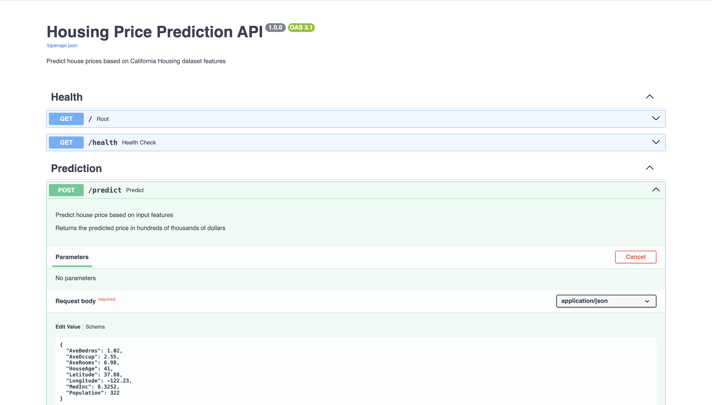

# Housing Price Prediction API (FastAPI + RandomForest)

This lab demonstrates how to expose a trained machine learning model as a REST API using **FastAPI** and **Uvicorn**.

Built by **Tanish Bhilare** for MLOps Course Assignment at Northeastern University.

---

## Project Structure
```
FastAPI-Lab/
├── model/
│   └── housing_model.pkl
├── src/
│   ├── __init__.py
│   ├── main.py
│   ├── predict.py
│   └── train.py
├── requirements.txt
└── README.md
```

---

## Setup

### 1) Create and activate a virtual environment

**macOS / Linux:**
```bash
python3 -m venv housing_env
source housing_env/bin/activate
```

**Windows (PowerShell):**
```bash
python -m venv housing_env
housing_env\Scripts\activate
```

### 2) Install dependencies
```bash
pip install -r requirements.txt
```

---

## Train the Model

From the project root:
```bash
cd src
python train.py
```

This generates:
- `model/housing_model.pkl`

**Model Performance:**
- RMSE: $0.54
- R² Score: 0.7738

---

## Run the API

From `src/`:
```bash
uvicorn main:app --reload
```

Open Swagger UI:  
**http://127.0.0.1:8000/docs**

---

## 📸 API Screenshots

### Swagger UI Documentation


*Interactive API documentation with FastAPI's built-in Swagger UI*

### Prediction Example


*Successful prediction showing house price of $435.61k*

The API successfully predicts house prices with the following response format:
- `predicted_price`: 4.35 (in units of $100k)
- `price_in_100k`: "$435.61k" (human-readable format)

---

## Endpoints

### `GET /`
Root endpoint - health check.

**Response:**
```json
{
  "status": "online",
  "message": "Housing Price Prediction API",
  "version": "1.0.0"
}
```

---

### `GET /health`
Detailed health check with model information.

**Response:**
```json
{
  "status": "healthy",
  "model": "Random Forest Regressor",
  "dataset": "California Housing"
}
```

---

### `POST /predict`
Predicts house price based on California Housing dataset features.

**Request:**
```json
{
  "MedInc": 8.3252,
  "HouseAge": 41.0,
  "AveRooms": 6.98,
  "AveBedrms": 1.02,
  "Population": 322.0,
  "AveOccup": 2.55,
  "Latitude": 37.88,
  "Longitude": -122.23
}
```

**Response:**
```json
{
  "predicted_price": 4.35,
  "price_in_100k": "$435.61k"
}
```

---

## Testing with cURL
```bash
curl -X POST "http://localhost:8000/predict" \
  -H "Content-Type: application/json" \
  -d '{
    "MedInc": 8.3252,
    "HouseAge": 41.0,
    "AveRooms": 6.98,
    "AveBedrms": 1.02,
    "Population": 322.0,
    "AveOccup": 2.55,
    "Latitude": 37.88,
    "Longitude": -122.23
  }'
```

---

## Dataset Features

The California Housing dataset expects **8 numeric features**:

1. **MedInc**: Median income in block group
2. **HouseAge**: Median house age in block group  
3. **AveRooms**: Average number of rooms per household
4. **AveBedrms**: Average number of bedrooms per household
5. **Population**: Block group population
6. **AveOccup**: Average number of household members
7. **Latitude**: Block group latitude
8. **Longitude**: Block group longitude

**Target Variable**: Median house value (in $100,000s)

---

## Technologies Used

- **FastAPI** - Modern, fast web framework for building APIs
- **scikit-learn** - Machine learning library (Random Forest)
- **Uvicorn** - Lightning-fast ASGI server
- **Pydantic** - Data validation using Python type hints
- **Pandas & NumPy** - Data manipulation

---

## Notes

- The model expects all 8 features in the exact order shown above
- Prices are predicted in units of $100,000 (multiply by 100 for actual dollar amount)
- If you get "model not found", retrain using `python train.py`
- CORS is enabled for web integration

---

## Author

**Tanish Bhilare**  
MS Data Science, Northeastern University  
MLOps Course - Spring 2026

Based on MLOps labs by Professor Ramin Mohammadi
