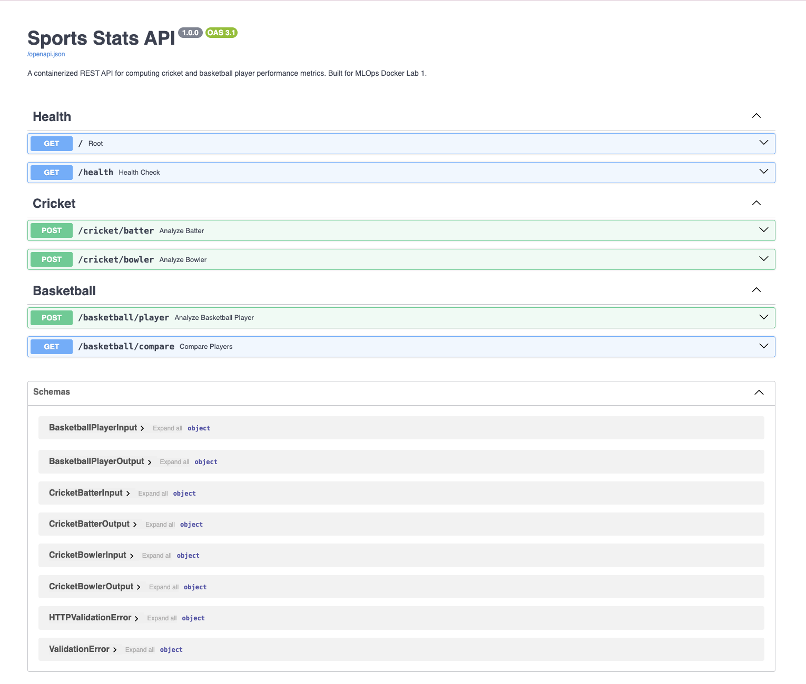

# Docker Lab 1 — Sports Stats API

**MLOps IE 7374 | Northeastern University**  
**Author:** Tanish Bhilare

---

## Overview

This lab demonstrates how to containerize a Python web service using Docker. I built a **Sports Stats API** that computes real performance metrics for cricket and basketball players — domains I work in through Northeastern's Cricket Club and NCAA bracket prediction work.

The API accepts raw match data and returns computed analytics like batting average, true shooting percentage, and a simplified Player Efficiency Rating.

**Original changes from the base lab:**
- Domain-specific app (cricket + basketball) instead of a generic example
- Multiple REST endpoints with Pydantic input validation
- Custom composite metrics (Impact Score, PER, role classification)
- Non-root Docker user for security
- HEALTHCHECK instruction in Dockerfile
- Docker Compose for single-command startup
- Pytest test suite with 8 test cases

---

## Project Structure
```
Docker_Labs/
├── app/
│   ├── __init__.py
│   └── main.py
├── tests/
│   ├── __init__.py
│   └── test_api.py
├── Dockerfile
├── docker-compose.yml
├── requirements.txt
├── .dockerignore
├── .gitignore
└── README.md
```

---

## API Endpoints

| Method | Path | Description |
|--------|------|-------------|
| GET | `/` | Service info and status |
| GET | `/health` | Health check |
| POST | `/cricket/batter` | Batting average, strike rate, impact score |
| POST | `/cricket/bowler` | Economy rate, bowling average, strike rate |
| POST | `/basketball/player` | PER, True Shooting %, Points per 36 |
| GET | `/basketball/compare` | Side-by-side composite comparison |

---

## API in Action

### Swagger UI


---

## Prerequisites

- [Docker Desktop](https://www.docker.com/products/docker-desktop/)
- Git

---

## How to Run

### Option 1 — Docker Compose (recommended)
```bash
git clone https://github.com/<your-username>/Docker_Labs.git
cd Docker_Labs
docker compose up --build
```

### Option 2 — Docker CLI
```bash
docker build -t sports-stats-api .
docker run -p 8000:8000 --name sports-stats-api sports-stats-api
```

### Option 3 — Local (no Docker)
```bash
python -m venv venv
source venv/bin/activate
pip install -r requirements.txt
uvicorn app.main:app --reload --port 8000
```

API live at: **http://localhost:8000**  
Swagger docs at: **http://localhost:8000/docs**

---

## Sample Requests

### Cricket Batter
```bash
curl -X POST http://localhost:8000/cricket/batter \
  -H "Content-Type: application/json" \
  -d '{
    "player_name": "Virat Kohli",
    "runs_scored": 500,
    "balls_faced": 420,
    "innings_played": 10,
    "times_not_out": 2,
    "fours": 45,
    "sixes": 10
  }'
```

### Basketball Player
```bash
curl -X POST http://localhost:8000/basketball/player \
  -H "Content-Type: application/json" \
  -d '{
    "player_name": "Jayson Tatum",
    "points": 26.5, "rebounds": 8.1, "assists": 4.9,
    "steals": 1.1, "blocks": 0.8, "turnovers": 2.3,
    "minutes_played": 35.2,
    "field_goals_made": 9.2, "field_goals_attempted": 20.1,
    "free_throws_made": 5.8, "free_throws_attempted": 6.9,
    "three_pointers_made": 2.3
  }'
```

---

## Running Tests
```bash
pip install pytest httpx fastapi
pytest tests/ -v
```

---

## Key Docker Concepts Used

- **Base Image:** `python:3.11-slim` — lightweight, only 50MB
- **Layer Caching:** requirements.txt copied before app code for faster rebuilds
- **Non-root User:** `appuser` created for security best practice
- **HEALTHCHECK:** Docker monitors `/health` endpoint every 30s
- **EXPOSE:** Documents port 8000 for container networking
- **Docker Compose:** Single command to build and run

---

## Technologies

- Python 3.11 | FastAPI | Pydantic v2 | Uvicorn
- Docker | Docker Compose
- Pytest + HTTPX