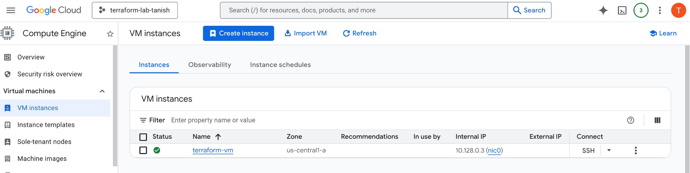
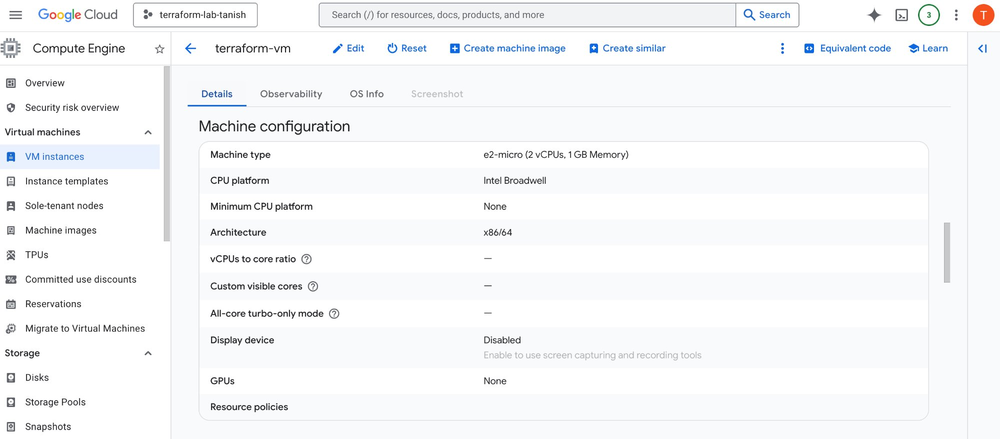
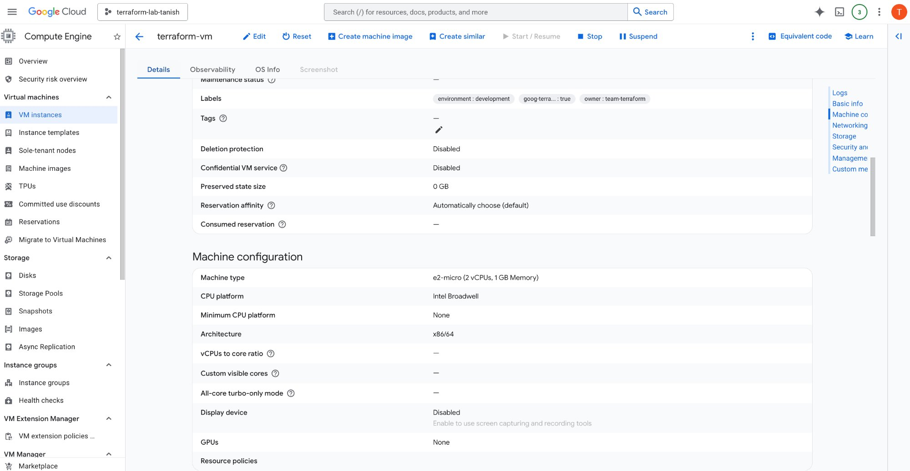
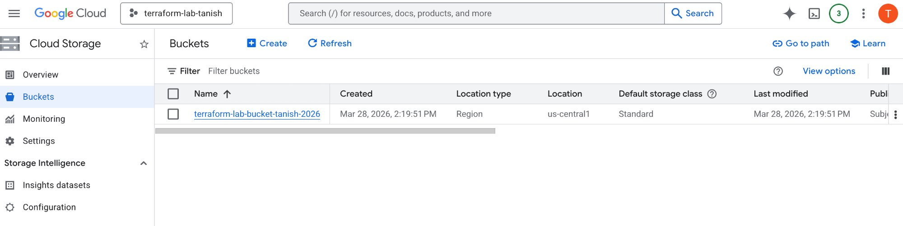
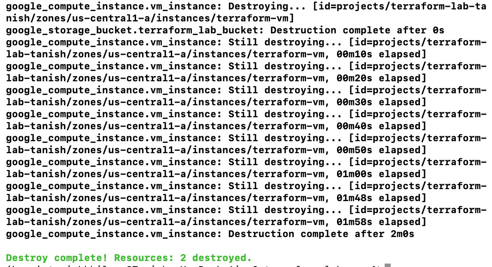

# Terraform Lab — GCP Infrastructure Management

## Objective
This lab demonstrates how to use Terraform to provision, modify, and destroy GCP infrastructure resources. It covers the full lifecycle of infrastructure-as-code (IaC) using a real GCP project.

---

## Prerequisites
- GCP account with billing enabled
- A GCP project (this lab uses `terraform-lab-tanish`)
- [Terraform](https://developer.hashicorp.com/terraform/tutorials/gcp-get-started/install-cli) installed
- [Google Cloud CLI](https://cloud.google.com/sdk/docs/install) installed and authenticated
- A GCP service account with Editor role and a downloaded JSON key

---

## Setup

### 1. Authenticate with GCP
```bash
gcloud init
gcloud config set project terraform-lab-tanish
```

### 2. Enable Compute Engine API
```bash
gcloud services enable compute.googleapis.com --project=terraform-lab-tanish
```

### 3. Create a Service Account and Download Key
```bash
gcloud iam service-accounts create terraform-service-account \
  --display-name "Terraform Service Account"

gcloud projects add-iam-policy-binding terraform-lab-tanish \
  --member="serviceAccount:terraform-service-account@terraform-lab-tanish.iam.gserviceaccount.com" \
  --role="roles/editor"

gcloud iam service-accounts keys create ~/Desktop/terraform-lab-key.json \
  --iam-account=terraform-service-account@terraform-lab-tanish.iam.gserviceaccount.com
```

### 4. Set Credentials Environment Variable
```bash
export GOOGLE_APPLICATION_CREDENTIALS="$HOME/Desktop/terraform-lab-key.json"
```

---

## Lab Walkthrough

### Part 1 — Initialise Terraform
Navigate to your lab directory and initialise Terraform:
```bash
terraform init
```
Terraform downloads the required GCP provider plugins on initialisation.

---

### Part 2 — Create a VM Instance
The initial `main.tf` provisions an `f1-micro` VM running Debian 11 in `us-central1-a`.

```bash
terraform plan   # Preview changes
terraform apply  # Apply changes, type 'yes' to confirm
```

**VM running on GCP Compute Engine:**



---

### Part 3 — Modify the VM
Updated the machine type from `f1-micro` to `e2-micro`, added environment labels, increased boot disk size to 12GB, and added `allow_stopping_for_update = true` to allow Terraform to stop the instance during changes.

```bash
terraform apply
```

> **Note:** Changing machine type on a running instance requires `allow_stopping_for_update = true` in the config, otherwise Terraform throws a 403 error.

**VM details showing `e2-micro` machine type:**



**VM labels — `environment:development` and `owner:team-terraform`:**



---

### Part 4 — Add a Cloud Storage Bucket
Added a `google_storage_bucket` resource to `main.tf` with `force_destroy = true` for easy cleanup.

```bash
terraform apply
```

**Storage bucket created in GCP:**



---

### Part 5 — Destroy All Resources
```bash
terraform destroy
```
Terraform destroys both the VM and the storage bucket cleanly.

**Destroy complete — both resources removed:**



---

### Part 6 — Key Terraform Files

| File | Purpose |
|------|---------|
| `main.tf` | Defines all infrastructure resources |
| `terraform.tfstate` | Tracks current state of deployed resources — never edit manually |
| `.terraform/` | Created by `terraform init`, stores provider plugins |
| `.terraform.lock.hcl` | Locks provider versions for reproducibility |

